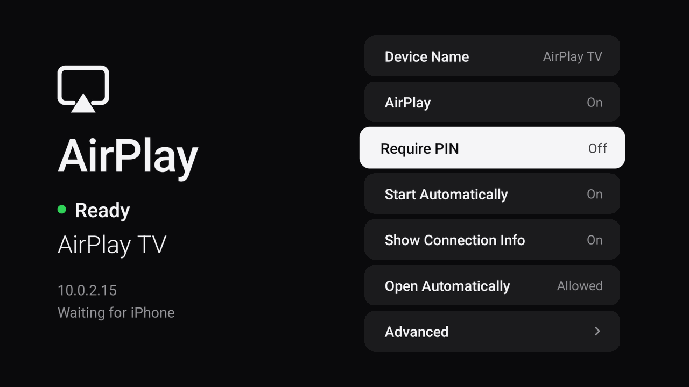
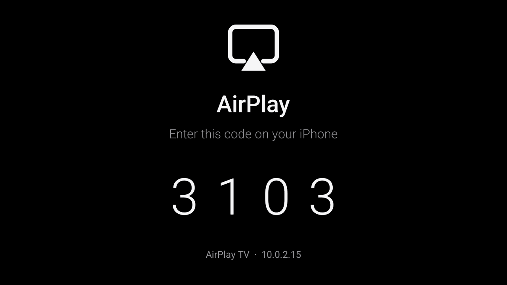

# AirPlay TV (geekylaneorgcf fork)

> **This is a fork of [besliky/airplay-tv](https://github.com/besliky/airplay-tv)**, tuned for a Fire TV Stick 4K Max
> on an OLED TV, mostly used for AirPlay **music** from YouTube Music. Everything below the line is the original README.
> The original is mirroring-first; this fork makes music a first-class use.

## What this fork adds

| Area | What it does |
| --- | --- |
| Wake from sleep | A sender that connects while the stick sleeps turns the screen on (HDMI-CEC then switches the TV on), also when playback resumes after a long pause. |
| Now Playing screen | Opens by itself for audio-only senders: cover, title, artist, album, progress with elapsed and remaining time, rounded transport buttons, volume bar. |
| Track info | The core now reads DMAP track info, cover art and progress that iOS pushes (they were accepted and ignored before). |
| Pause detection | A pause is detected from the audio running dry (YouTube Music sends no FLUSH when pausing), and the stale progress update sent at a pause is discarded. |
| Remote control | The Fire remote's play/pause and next/previous media keys (and OK) control the phone through DACP; media keys also work while the screen is not focused. Left and right on the ring seek: a tap jumps 10 seconds, holding scrubs faster the longer it is held, and the phone is asked once the keys stop. Whether the sender honours a seek depends on the app (iOS' DACP is undocumented); if it does not, the player says so once and holding the key scans like an iPod's fast forward instead. |
| TV settings button (opt-in) | The Fire remote's Menu button (the three bars next to Home) opens an LG TV's quick settings (picture mode, sound output, ...) by pressing the TV's own gear button over the network (LG webOS remote protocol). One-time setup in the app: it finds the TV, shows the certificate the TV presents (every LG TV signs its own) for the owner to trust, and the TV asks to accept the connection on its own remote. Certificates stay verified: only the one the owner confirmed is trusted. It works while the player is open; in every app with the Menu button service (below). |
| One volume | The phone's slider and the remote's volume/mute keys drive the same volume inside the app (the stick's HDMI output stays at full scale). Where the system can move its volume, the number is read as the key presses; with HDMI-CEC on (the TV owns the volume and Fire OS drops the keys) the Menu button service takes the volume keys during a session instead. A small volume bar shows over any screen but the player's whenever the level moves. |
| Animations | Slide in the direction of travel for next/previous, cover shrinks while paused, backdrop tinted from the cover (dithered once it holds still, so a dark gradient does not show one-level bands on an OLED). |
| Lyrics (opt-in) | Synced lyrics from [lrclib.net](https://lrclib.net); only title and artist are sent. Off by default, the only feature that uses the internet. Down opens them, Up/Back closes. A title such as "Song (feat. X)" is searched again without the decoration, a lookup that failed (offline, rate limit) is retried instead of being reported as "no lyrics", and another cut of a song still gives its words as plain lyrics. |
| OLED care | Slow orbit of the layout. With nobody using the remote: dim after 3 min (about one song), then a minimal display after 8 min (only the song, progress and times, small and dim, drifting over black), then nothing lit after 30 min; paused for 15 min lets the display sleep. A new song shows itself for a few seconds without counting as use, and neither does the phone repeating its volume. |
| Back to the player | Three ways, no iPhone needed. Start the app from the Home screen while music plays and it opens the player instead of the settings. While music plays and the TV is left alone, the player takes over from the system screensaver (starting already in its minimal, dim stage). And pressing play, pause, next or previous on the remote while the player is hidden shows it for six seconds, then returns to what was on screen (any key keeps it). The "Return To Player" setting turns the last two off. The remote's Menu key opens the settings from the player. |
| Sleep after music (opt-in) | Turns the TV off again a few minutes after the music stops, only if AirPlay woke it and nobody touched the remote. Needs a one-time accessibility-service setup, see below. |
| Photos | The receiver already advertised photo support (inherited feature bits) but refused every HTTP request. It now handles `GET /server-info`, `POST /reverse`, `PUT /photo` with the asset cache (`cacheOnly`/`displayCached`), `POST /stop`. |
| Signing | Releases are signed with a stable key so updates install over the previous one with `adb install -r`. |

### Settings (open the app on the TV)
- **Lyrics**: Off by default. Turning it on explains what is sent.
- **YouTube Music Lyrics** (shown when Lyrics is on): Off by default. Also looks a song up on YouTube Music when lrclib.net has nothing for it; plain text only, see the dialog it shows.
- **Return To Player**: On (default) or Off, see the table above.
- **Sleep After Music**: Off / 2 / 5 / 10 / 20 minutes. Needs the accessibility service, switched on once from a computer:
  ```sh
  adb shell settings put secure enabled_accessibility_services io.github.besliky.airplaytv/.service.SleepService
  adb shell settings put secure accessibility_enabled 1
  ```
  (`/.service.SleepService` is the short form of the full class name and means the same; add it to the existing
  colon-separated list if you already use another accessibility service.)
  Fire OS protects its own sleep action with a signature permission, so no normal app can do this without it.
- **TV Settings Button**: Off / Needs setup / On. Pressing the row finds an LG TV with a UPnP search, asks you to trust the
  certificate it presents, and the TV shows a prompt to accept (with the TV's own remote). After that the Menu button opens the
  TV's quick settings from the player. To have it in every app, the Menu button has to be taken before the app in front sees it,
  which only an accessibility service can do (it sees the Menu key only and lets every key through while the setting is off).
  The app shows the two commands for your stick under *Use In Every App*; they keep any services that are already on, e.g.
  ```sh
  adb shell settings put secure enabled_accessibility_services io.github.besliky.airplaytv/.service.MenuKeyService
  adb shell settings put secure accessibility_enabled 1
  ```

### Looking at the screen without a phone
```sh
adb shell am start -n io.github.besliky.airplaytv/.ui.MainActivity --es preview now
```
Modes: `now`, `pause`, `lyrics`, `lyricsnet` (real lookup), `nolyrics`, `lyricsloading`, `lyricsdown`, `dim`, `minimal`, `black`,
`blank`, `goodnight`, `volume`, `next`, `previous`, `skip` (three skips as a real session delivers them: blank album, a short pause, a late cover), `photo`, `photo2`, and `oledcare`, which runs the whole OLED care timeline by
itself, 60 times faster (`--ei speed 60`, so the 8 minute stage arrives after 8 seconds). It uses invented data and puts the real state back when
you press Back. Capture the TV output with `adb exec-out screencap -p > shot.png`.

Dialogs can be looked at the same way without changing a setting: `dialog-sleep`, `dialog-overlay`, `dialog-lyrics`,
`dialog-reset`. `dither` shows four strips of one dark gradient (plain, framework dither flag, software dither, the Now Playing
backdrop) to compare banding.

### Known limits
- The icon an iPhone draws for this receiver is the Apple TV tile, because the receiver says it is an Apple TV. Saying anything
  else on the full service (`FireTV` was tried) makes the iPhone connect over and over without ever starting a session: it needs a
  receiver that speaks AirPlay 2 to be accepted as anything but an Apple TV. Advanced > **Appears On iPhone As** has a trial for a
  speaker icon: only the audio service is published, under a model iOS does not know (the way shairport-sync is drawn as a speaker),
  so only music works, not screen mirroring or photos. It switches itself back to Apple TV after 30 minutes unless music has started
  from an iPhone by then (that confirms it). Whether iOS accepts it can only be seen on a real iPhone.
- YouTube and other apps' in-app **AirPlay video** (the cast button) is not supported (`POST /play` is refused and logged);
  Screen Mirroring is. Audio-only AirPlay from music apps is the main use.
- Photos: implemented from the unofficial protocol notes and a loopback test; not yet verified against every iOS version. Slideshows are refused.
- Apps that forbid screen recording (Netflix etc.) mirror black.

---

# AirPlay TV

**Screen mirroring from iPhone and iPad to Android TV, the way a TV with built-in AirPlay does it.**

Open Control Center on the iPhone, tap *Screen Mirroring*, pick your TV — the phone's
screen appears on the TV. No app to open on the TV first, no account, no cloud.



AirPlay TV is a small, open-source AirPlay receiver for Android TV and Google TV. It runs
as a background service, starts with the TV, announces itself on the local network and
brings up the picture automatically when a sender connects. Video is decoded by the TV's
hardware decoder straight onto the screen. The APK is about 350 KB.

## Features

- **Screen mirroring** from iPhone, iPad and Mac
  - H.264 up to 1080p60 by default
  - H.265 up to 4K on TVs with a hardware HEVC decoder (Advanced → Resolution Limit → 4k)
  - Portrait and landscape, rotation and resolution changes while mirroring
  - Picture pauses and resumes with the sender (lock screen, app switches)
- **Audio** during mirroring (AAC-ELD) and as an AirPlay speaker for music (ALAC, AAC-LC),
  volume controlled from the sender
- **Always available**: starts on boot, survives app updates and process restarts,
  re-announces itself after network changes and when the TV wakes up
- **Low latency**: hardware decoding into the display surface, vendor low-latency decoder
  modes where available, only the newest picture is shown, small audio buffer
- **Optional PIN pairing**: first connection of each iPhone requires the code shown on the
  TV, afterwards it is remembered; pairing can be reset at any time
- **Performance overlay** (fps, bitrate, decode time, latency, drops) and a diagnostics export
- **Private by design**: local network only, no internet access needed, no analytics

## Status

Version 0.1.0 is the first release. The protocol core — pairing, PIN pairing, session
setup, the encrypted mirror and audio streams and all parsers of network input — is covered
by unit, loopback and fuzz tests that run on every commit. The app has been run end to end
on an Android TV emulator with a protocol-level test sender: discovery, mirroring with
audio, PIN pairing, autostart after a reboot and recovery after the process is killed.
It has not yet been tried with a real iPhone on TV hardware, so reports from real TVs and
iPhones are very welcome; please attach the diagnostics export (Advanced → Export
Diagnostics).

## Install

1. Download `AirPlayTV-v<version>-arm64.apk` from the
   [latest release](../../releases/latest). Use `armv7` for older 32-bit TVs, `x86_64` for
   emulators, or `universal` if unsure.
2. Install it with a file manager or a downloader app (allow installing unknown apps), or
   from a computer: `adb install AirPlayTV-v0.1.0-arm64.apk`.
3. Open **AirPlay TV** once. The status turns to *Ready*.
4. Select **Open Automatically → Allow** and allow *Display over other apps*. Android 10 and
   later require this permission before a background app may show the picture by itself.
   If your TV has no such setting in its menus, enable it once from a computer:

   ```
   adb shell appops set io.github.besliky.airplaytv SYSTEM_ALERT_WINDOW allow
   ```

5. On the iPhone: **Control Center → Screen Mirroring → AirPlay TV**.

From then on nothing needs to be opened on the TV. Press **Back** on the remote to stop
mirroring; pressing **Home** leaves the session (and its audio) running in the background.

## Settings

| Setting | |
|---|---|
| Device Name | Name shown on the iPhone (default *AirPlay TV*) |
| AirPlay | Turns the receiver on or off |
| Require PIN | Ask for a code on first connection of each device |
| Start Automatically | Start the receiver when the TV boots |
| Show Connection Info | Show the TV's IP address on screen |
| Open Automatically | Permission to show the picture as soon as mirroring starts |
| Advanced | Preferred decoder, resolution limit (720p / 1080p / 4k), frame rate (30 / 60), performance overlay, detailed logs, export diagnostics, paired devices, reset pairing, licenses |



## Compatibility

- **TV**: Android TV / Google TV with Android 8.0 (API 26) or newer. Phones and tablets
  work as well.
- **CPU**: arm64-v8a (recommended), armeabi-v7a, x86_64.
- **Senders**: iPhone, iPad and Mac. The receiver implements the AirPlay mirroring
  protocol in the same way as [UxPlay](https://github.com/FDH2/UxPlay), which works with
  current iOS, iPadOS and macOS releases.

Android 8.0 is the minimum because it is the first release with everything the pipeline
relies on without compatibility layers: notification channels for the background service,
`AImageReader` private surfaces (used to keep the decoder running while the playback
screen is hidden), `AMediaCodec_setOutputSurface` and adaptive icons. Android TV devices
still on 7.x are rare.

## Limitations

- **Protected content**: apps that forbid screen recording (Netflix, Apple TV+, Disney+ and
  similar) show a black screen or stop mirroring. This is enforced on the iPhone and is not
  a receiver problem.
- **Not supported**: AirPlay 2 multi-room audio, AirPlay "video" URL playback (e.g. the
  AirPlay button inside some video apps, which uses HLS instead of mirroring), HomeKit
  pairing. Mirroring and AirPlay audio work.
- **One sender at a time**: a new sender replaces the current one.
- **Sleeping TVs**: the TV has to be on, or in a standby mode that keeps the network up.
  AirPlay cannot wake a TV that has powered its network down.
- **Opening automatically** needs the *Display over other apps* permission on Android 10+
  (see Install). Without it a notification offers to open the picture.
- **Audio/video sync**: both streams are played with minimal delay rather than being
  aligned to a common clock, which keeps latency low but leaves lip sync to the similar
  pipeline delays of both paths.

## Privacy

AirPlay TV works entirely inside your local network and needs no internet connection.

- No analytics, telemetry, crash reporting, advertising, accounts or cloud services.
- The only network activity is the Bonjour (mDNS) announcement through Android's own
  service discovery and incoming AirPlay connections. Connections from outside the TV's
  local subnet are refused.
- The receiver's pairing key is encrypted with a key held in the Android Keystore. Paired
  devices are stored as public keys only. Backups are disabled.
- Diagnostics are written to the app's own storage on the TV and are never sent anywhere;
  they contain no keys, PINs or device names.

## How it works

```
iPhone ──mDNS──▶ Android NSD (_airplay._tcp, _raop._tcp)
   │
   └──RTSP/TCP──▶ native receiver (C, libairplaytv.so)
                    ├─ pairing (Ed25519/X25519, SRP PIN), FairPlay setup
                    ├─ mirror stream (TCP, AES-CTR) ──▶ AMediaCodec ──▶ Surface
                    └─ audio (RTP/UDP, AES-CBC) ──▶ AAC/ALAC ──▶ AudioTrack

BootReceiver ──▶ ReceiverService (foreground) ──▶ NetworkMonitor, Advertiser
                        └── MirrorActivity (full-screen surface, PIN, overlay)
```

The protocol core is C; decoding and rendering use the NDK media APIs, so video never
passes through Java. See [docs/ARCHITECTURE.md](docs/ARCHITECTURE.md) for threads, the
latency policy, lifecycle handling and security measures.

## Building

Requirements: JDK 17, Android SDK platform 36 and build-tools 36, NDK 28.2.13676358,
CMake 3.22.1 (Gradle downloads what is missing).

```
./gradlew assembleDebug          # debug APKs in app/build/outputs/apk/debug
./gradlew packageReleaseApks     # release APKs + SHA256SUMS in app/build/dist
./gradlew testDebugUnitTest lintRelease
```

Release builds are signed with your debug key unless a release key is configured, so a
local release build installs straight away. To sign with your own key, create
`keystore.properties` in the project root (it is git-ignored):

```
storeFile=/path/to/release.jks
storePassword=...
keyAlias=...
keyPassword=...
```

Native tests and fuzzers (Linux or macOS, clang):

```
cmake -S core -B build -DAIRPLAYTV_TESTS=ON -DAIRPLAYTV_SANITIZE=ON && cmake --build build
ctest --test-dir build --output-on-failure
cmake -S core -B build-fuzz -DCMAKE_C_COMPILER=clang -DAIRPLAYTV_TESTS=ON -DAIRPLAYTV_FUZZ=ON
cmake --build build-fuzz && ./build-fuzz/tests/fuzz_rtsp -max_total_time=60
```

See [docs/TESTING.md](docs/TESTING.md) for the test sender that streams a generated
picture to a running receiver, and [docs/RELEASING.md](docs/RELEASING.md) for CI and
release signing.

## Project layout

```
app/        Android app (Kotlin, no AndroidX): service, discovery, UI
core/src/   protocol core (RTSP, pairing, FairPlay setup, mirror and audio streams)
core/android/  JNI bridge, AMediaCodec video decoder, audio pipeline
core/third_party/  vendored Mbed TLS subset, Monocypher, playfair, ALAC decoder
core/tests/ unit, loopback and fuzz tests, test sender
docs/       architecture, testing, releasing
```

## License

AirPlay TV is free software under the GNU General Public License v3.0 or later
(see [LICENSE](LICENSE)). It builds on UxPlay, playfair, Mbed TLS, Monocypher and an ALAC
decoder — see [THIRD_PARTY_LICENSES.md](THIRD_PARTY_LICENSES.md).

AirPlay, Apple TV, iPhone and iPad are trademarks of Apple Inc. This project is an
independent implementation and is not affiliated with or endorsed by Apple.
